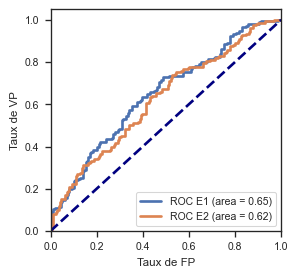

# TP_MAP6014
Prédiction du risque de départ d'un employer a l'aide du dataset [turnover.csv](./datasets/turnover.csv) et [turnover_prepared.csv](./datasets/turnover_prepared.csv). Vous trouverez si join le [code source](./TP_MAP6009.ipynb) des expérimentations du [Rapport]() .

- [Description du dataset](#description-du-dataset)
- [Avant de Commencer le Travail](#avant-de-commencer-le-travail)
    - [Créer un environnement virtuel python](#creer-un-environnement-virtuel-pythoncreer-)
    - [Lancer L'environnement Python](#lancer-lenvironnement-python)
    - [Installer jupyter et jupyter kernel](#installer-jupyter-et-jupyter-kernel)
    - [Créer et installer un nouveau kernel jupyter](#creer-et-installer-un-nouveau-kernel-jupyter)
- [Lancer le code source](#lancer-le-code-source)
- [Resultats obtenus](#resultats-obtenus)
- [Références](#references)
## Description du dataset
INFORMATIONS SUR LES COLONNES LE DATASET
• stag : Expérience (temps)
• event : Rotation du personnel (démission de l'employé)
• gender : Sexe de l'employé (femme (f) ou homme (m))
• age : Âge de l'employé (année)
• industry : Industrie de l'employé
• profession : Profession de l'employé
• traffic : Provenance de l'employé dans l'entreprise. Vous avez contacté l'entreprise directement
(après avoir entendu parler de la publicité, en connaissant la marque de l'entreprise, etc.) -
advert. Vous avez contacté l'entreprise directement sur la recommandation d'un ami - pas un
employé de cette entreprise - recNErab. Vous avez contacté l'entreprise directement sur la
recommandation d'un ami - un employé de cette entreprise - referal. Vous avez postulé pour un
poste sur un site d'emploi - youjs. L'agence de recrutement vous a amené chez l'employeur -
KA. Invité par l'employeur, nous le connaissions avant l'emploi - friends. L'employeur vous a
contacté sur la recommandation d'une personne qui vous connaît - rabrecNErab. L'employeur
vous a trouvé grâce à votre CV sur le site d'emploi - empjs.
• coach : Présence d'un coach (formation) pendant la période d'essai
• head_gender : Sexe du responsable (superviseur)
• greywage : Salaire qui ne semble pas déclaré aux autorités fiscales. Le terme "greywage" en
Russie ou en Ukraine signifie que l'employeur (l'entreprise) paie juste un petit montant audessus
du salaire déclaré (le salaire déclaré signifie le salaire minimum)
• way : Mode de transport de l'employé
• extraversion : Score d'extraversion
• independ : Score d'indépendance
• selfcontrol : Score de maîtrise de soi
• anxiety : Score d'anxiété
• novator : Score d'innovation
## Avant de Commencer le Travail
### Créer un environnement virtuel python
`conda create --name tp_map6014 python=3.8`
### Lancer L'environnement Python 
`conda activate tp_map6014`
### Installer jupyter et jupyter kernel
```
conda install jupyter
conda install ipython
conda install ipykernel
pip install bash_kernel
```
### Créer et installer un nouveau kernel jupyter 
```
ipython kernel install --user --name=tp_map6014
python -m ipykernel install --user --name=tp_map6014
python -m bash_kernel.install
```
### Setup de l'environement suivant votre system
font et librairies
#### Ubuntu  
`sh setup/ubuntu/setup.sh`
#### Mac os
`sh setup/macos/setup.sh` 
## Lancer le code source (jupyter)
`Make open`
## Resultats obtenus

## Avant le build
Installation des dependances du code python
`Make dep`
## Build
Vous pouvez build le model, pdf...
`Make build`
## Références
* [venv installations and kernel creation](https://medium.com/@WamiqRaza/how-to-create-virtual-environment-jupyter-kernel-python-6836b50f4bf4)
* [Theme](./theme/AdobeColor-My%20Color%20Theme-3.jpeg)
* [Latex](https://guides.nyu.edu/LaTeX/installation)
* [Color Generator](https://color.adobe.com)